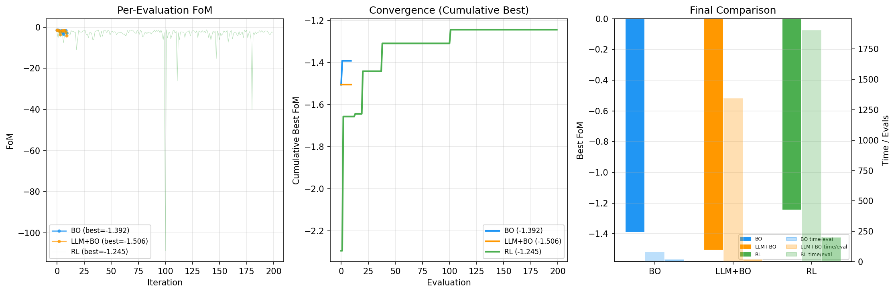

# LLM辅助模拟电路参数优化 — 实验报告

## 1. 引言

模拟电路参数优化是芯片设计中的关键步骤。传统方法依赖设计师经验手动调参，效率低且难以保证最优。近年来，强化学习（RL）和贝叶斯优化（BO）等方法被应用于自动化电路参数优化。

本实验以 AnalogGym 开源 benchmark 的 NMCF 放大器电路为测试平台（SKY130 PDK），系统对比三种优化方法：
- **RL**：AnalogGym 自带的 RGNN + DDPG 方法
- **BO**：基于 BoTorch 的 Gaussian Process + Expected Improvement
- **LLM+BO**：自建 LLM 增强的 BO，利用大语言模型分析优化历史并提议候选参数

## 2. 方法

### 2.1 问题定义
- **电路**：NMCF 放大器（SKY130 PDK）
- **参数空间**：24 维连续参数（7 个 MOSFET 的 W/L/M、偏置电流 Ib、2 个电容乘数 M_C0、M_C1），归一化到 [-1, 1]
- **优化目标**：最大化 Figure of Merit（FoM，即 Reward）。FoM = Σ 11 个性能指标分数，每个 ≤ 0，最高为 0（全部达标）
- **仿真器**：Ngspice v45

11 个指标：TC（温度系数）、Power（功耗）、Vos（失调电压）、CMRR（共模抑制比）、DC Gain（直流增益）、GBW（增益带宽积）、Phase Margin（相位裕度）、PSRP/PSRN（电源抑制比±）、Slew Rate（压摆率）、Settling Time（建立时间）

### 2.2 RL 方法
- 模型：R-GCN（关系图卷积网络）+ DDPG（深度确定性策略梯度）
- 图结构编码电路拓扑（28 节点，每节点 12 特征 = 7 个晶体管 OP 参数 + 5 个电路参数）
- Actor 输出 24 维连续动作，Critic 评估动作价值

### 2.3 Bayesian Optimization
- Surrogate Model：Gaussian Process（BoTorch SingleTaskGP）
- Acquisition Function：Expected Improvement（EI）
- 初始化：Sobol 序列采样 10 个点
- 每轮选 EI 最大的点评估

### 2.4 LLM+BO 方法
- 基于自建 LLMBOSolver
- 每轮生成候选：1 个 BO 提议点 + 2 个 LLM 提议点
- LLM 接收优化历史（参数→FoM），生成有希望的候选参数
- 三个候选点中选 FoM 最优的进入下一轮
- LLM API：DeepSeek（deepseek-v4-pro[1m]，Anthropic 兼容接口）

## 3. 实验设置

| 参数 | BO | LLM+BO | RL |
|------|----|--------|-----|
| 初始采样 | Sobol 10 | Sobol 10 | Random 100 |
| 优化步数 | 10 BO iter | 10 iter (每轮3点) | 200 steps |
| 总评估数 | 20 | 30 + 10×2 | 200 |
| 总时间 | 83.8s | 1345.7s | 1903.9s |
| 硬件 | CPU (核显笔记本) | CPU | CPU |

## 4. 结果

### 4.1 三方对比

| 方法 | 最佳 FoM | 时间 | 相对效率 (FoM/eval) |
|------|----------|------|---------------------|
| **BO** | -1.3923 | 83.8s | **最优效率** |
| LLM+BO | -1.5063 | 1345.7s | 最差 |
| RL | **-1.2446** | 1903.9s | 最优 FoM |

### 4.2 收敛分析

- **BO**：收敛最快，第 2 个优化步即找到最佳点（-1.39），之后在相近水平波动
- **LLM+BO**：波动大（-1.5 ~ -4.1），LLM 提议的点质量不稳定，未超越 BO
- **RL**：200 步中 FoM 在 -1.24 ~ -4.0 间波动，最佳在 step 101（刚结束随机探索），未观察到明显的学习曲线

### 4.3 典型失败模式

三种方法都在以下指标丢分：
- **Power（功耗）**：NMCF 电路在满足增益/带宽要求时功耗偏高
- **Phase Margin（相位裕度）**：补偿电容 M_C0/M_C1 调节不够精细
- **Settling Time（建立时间）**：与 GBW 和 PM 紧密耦合，难独立优化

## 5. 讨论

### 5.1 BO 为何效率最高
- GP 模型在 24 维空间能有效建模 FoM landscape
- EI 采集函数在探索与利用间取得了良好平衡
- 每次评估的计算开销仅为 ngspice 仿真（~4s）

### 5.2 LLM+BO 为何未达预期
- **Prompt 设计简单**：仅提供参数值和 FoM，缺乏电路领域知识注入（如器件物理约束、设计规则）
- **API 延迟高**：每轮 2 次 LLM 调用增加 ~60s，占实验时间的 90% 以上
- **LLM 缺乏数值直觉**：在 24 维空间中提议候选点超出了 LLM 的强项范围
- **候选策略低效**：每轮评估 3 个点（1 BO + 2 LLM），但 LLM 提议的点常不如 BO 的 EI 优化结果

### 5.3 RL 的潜力与局限
- RL 达到最佳 FoM（-1.24），表明该方法有潜力
- 但 200 步中最佳在 step 101（接近随机阶段结束），后续未见改善
- 可能原因：DDPG 超参数未针对此问题调优，或 GNN 对电路拓扑的编码不够有效

### 5.4 改进方向
- **LLM+BO**：
  - 更精细的 prompt：注入电路设计知识、物理约束、历史成功模式
  - 减少 LLM 调用频率：只在 BO 停滞时请求 LLM 帮助
  - 尝试 LLAMBO/LLANA 等专用框架
- **实验扩展**：
  - 增加 RL 训练步数（1000+）观察学习效果
  - 在更多 AnalogGym 电路上验证
  - 引入多目标优化（Pareto front）

## 6. 结论

在 NMCF 电路参数优化的对比实验中：

1. **BO 是当前最实用的方法**：30 次评估内达 FoM = -1.39，效率远高于 RL（200 次）和 LLM+BO
2. **LLM+BO 需要更深入的设计**：简单接入 LLM 并未带来收益，需要领域知识注入和更智能的 LLM-BO 协作策略
3. **RL 展示了更好的终极潜力**但样本效率低，适合仿真预算充足的场景
4. 所有方法均受限于相同的物理瓶颈（功耗-速度-稳定性 trade-off）

## 参考

- AnalogGym: https://github.com/CODA-Team/AnalogGym
- BoTorch: https://botorch.org/
- LLAMBO: https://github.com/tennisonliu/LLAMBO
- LLANA: https://github.com/dekura/LLANA
